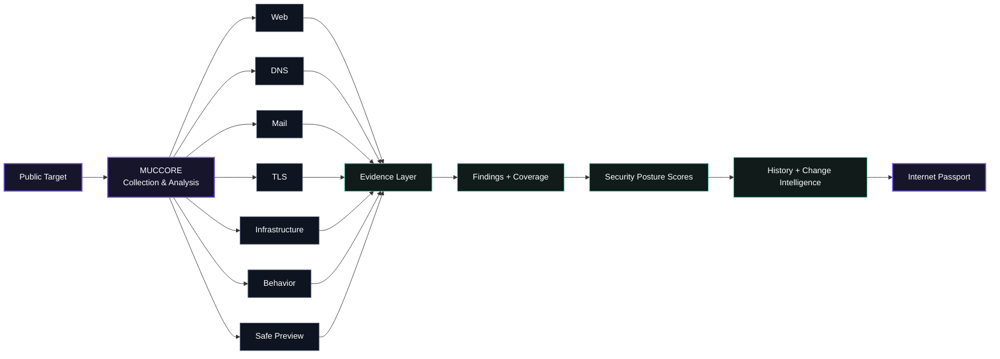
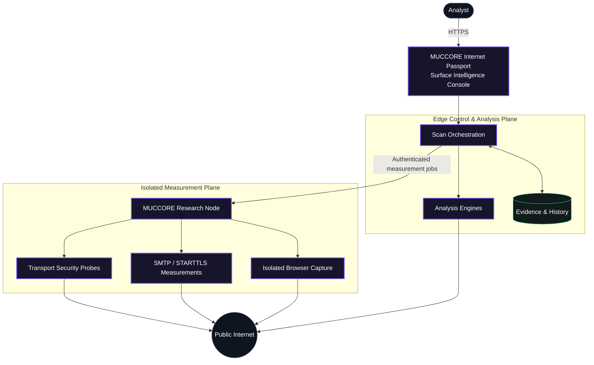
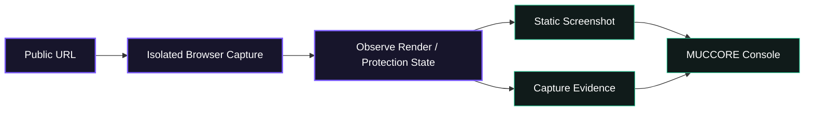

# MUCCORE Internet Passport

**Public Surface Intelligence for domains and Internet-facing services.**

**Live platform:** https://passport.muccore.com  
**Türkçe:** [README.tr.md](README.tr.md)

MUCCORE Internet Passport turns a public domain into an evidence-backed view of its Internet-facing security posture. A single assessment correlates web, DNS, email, TLS, infrastructure and behavioral evidence, adds an isolated visual preview, and presents the result through one surface-intelligence console.

> This repository contains **public product documentation only**. The production source code, deployment configuration, internal endpoints and operational secrets are intentionally not published here.

## What MUCCORE analyzes

| Surface | Coverage |
|---|---|
| **Web Security** | HTTPS behavior, redirects, security headers, HSTS, CSP, framing protections, cookie attributes and browser-facing policy controls |
| **DNS Security** | Core DNS records, DNSSEC, CAA, authoritative nameserver posture and DNS evidence |
| **Mail Security** | MX topology, SPF, DMARC, MTA-STS, TLS-RPT and SMTP/STARTTLS transport evidence |
| **TLS & Certificates** | Protocol capability, certificate trust and hostname checks, chain/expiry evidence, cipher observations, legacy TLS and forward secrecy |
| **Infrastructure** | Public IPv4/IPv6 relationships, MX infrastructure, PTR/rDNS and Internet-facing topology evidence |
| **Behavior Signals** | Passive signals such as redirects, forms, password fields, iframes, external scripts and related observable behavior |
| **Safe Preview** | Isolated browser rendering, static screenshot evidence and detection/classification of access challenges or protection pages |

MUCCORE also provides coverage-aware scoring, structured findings, technical evidence, JSON export, scan history and comparison with previous observations.

## Product model

## High-level architecture

The public architecture intentionally describes **responsibilities**, not private implementation details.

The **control and analysis plane** validates targets, coordinates modules, normalizes evidence, calculates coverage-aware results and maintains historical observations. The **isolated measurement plane** performs measurements that require a real network or browser runtime. This separation keeps the public application layer distinct from active measurement execution.

## Evidence-aware scoring

MUCCORE does not turn missing telemetry into an automatic security failure.

- A module is scored from evidence that was actually measured.
- `UNKNOWN` means evidence was insufficient or unavailable; it is not automatically a failure.
- `NOT_APPLICABLE` does not create a penalty.
- Informational observations are separated from score-impacting findings.
- When required coverage is missing, MUCCORE can withhold a numeric conclusion rather than invent confidence.

This makes the score a summary of observed posture, while the underlying findings and evidence remain available for interpretation.

## Safe Preview

Safe Preview is designed to provide visual context without embedding the live target into the analyst's browser.

Modern pages may execute JavaScript inside the isolated capture environment so they can render correctly. The analyst receives static visual/evidence output rather than the target's live interactive page. Observed CAPTCHA, challenge, access-denied or bot-protection states can be classified as evidence; MUCCORE does not attempt to solve CAPTCHA or bypass site-specific protections.

## History & change intelligence

A single scan is a snapshot. Repeated observations turn that snapshot into a timeline. MUCCORE can compare a new assessment with previous stored evidence to surface meaningful posture changes such as security-policy changes, mail-routing changes, TLS capability changes, certificate lifecycle changes and module coverage/score changes.

Current product policy retains scan evidence for **30 days**. Safe Preview screenshots use a shorter **24-hour** retention window.

## Security philosophy

MUCCORE treats every target as untrusted input and is designed around public-surface, low-impact observation. Private/reserved network destinations are outside the intended target space, and the platform applies outbound-target controls before measurement.

The platform is **not** intended for exploit delivery, brute force, credential testing, destructive requests, broad directory fuzzing or general-purpose port scanning.

## Current scope

MUCCORE is actively developed. Current production scope focuses on public web, DNS, mail, TLS, infrastructure, passive behavior signals, isolated preview, evidence-aware scoring and historical comparison. Richer registration/provider intelligence and additional enrichment can be added as the platform evolves.

---

**MUCCORE Internet Passport** — evidence first, surface aware, built for understanding what the Internet can see.
