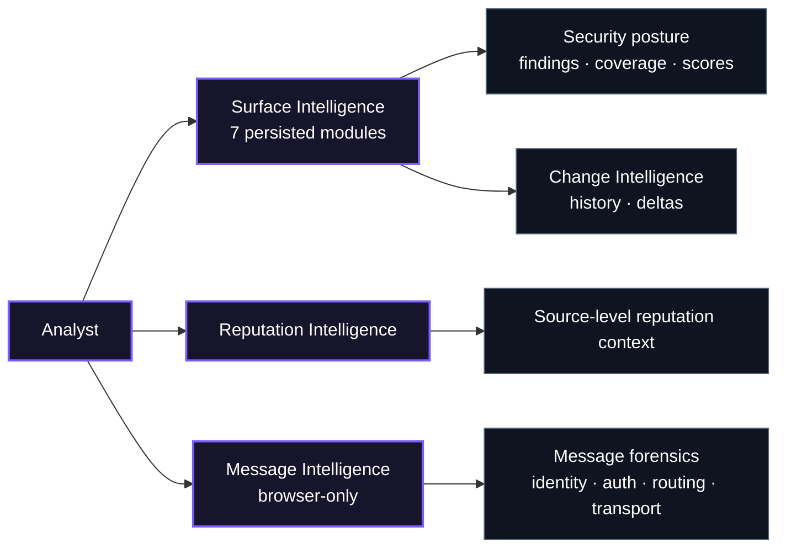
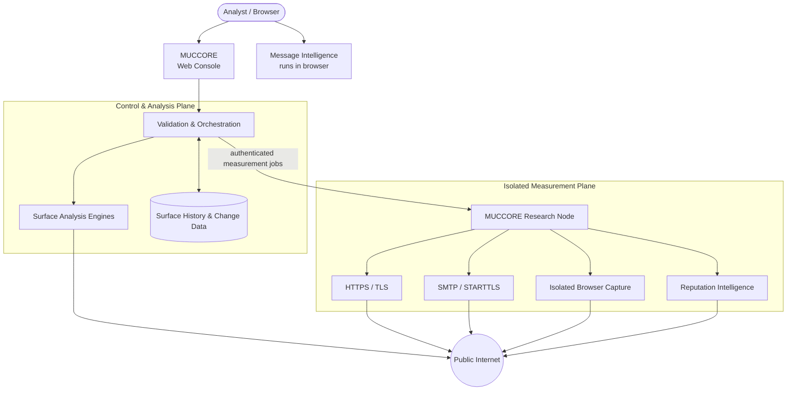
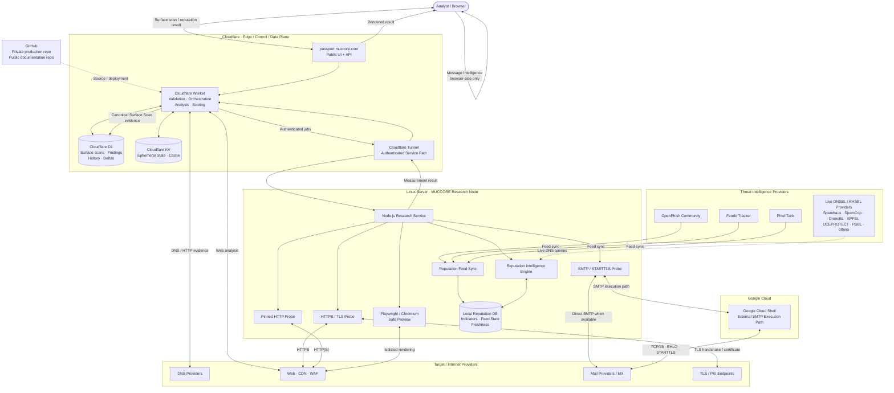

# MUCCORE Internet Passport

**See your digital presence from the outside.**

[](https://passport.muccore.com)
[](https://passport.muccore.com)

**Live platform:** https://passport.muccore.com  
**Türkçe:** [README.tr.md](README.tr.md)

MUCCORE Internet Passport is a security research platform for understanding how a digital presence appears from the outside. It combines persisted **Surface Intelligence**, dedicated **Reputation Intelligence**, browser-only **Message Intelligence**, and **Change Intelligence** in one product.

> This repository contains **public product documentation only**. Production source code, secrets and private operational configuration are not published here.

## Product at a glance

### Surface Intelligence — 7 persisted scan modules

| Module | What it observes |
|---|---|
| **Web Security** | HTTP/HTTPS behavior, redirects, security headers, HSTS, CSP, framing controls, cookies and browser-facing policies |
| **DNS Security** | Public DNS records, DNSSEC, CAA and authoritative nameserver posture |
| **Mail Security** | MX inventory, SPF, DMARC, MTA-STS, TLS-RPT and SMTP/STARTTLS transport observations |
| **TLS & Certificates** | Certificate trust/hostname/chain/expiry, TLS capability, negotiated cipher and bounded protocol/cipher observations |
| **Infrastructure** | Public IPv4/IPv6 relationships, PTR/rDNS, edge/topology and bounded network/ASN enrichment |
| **Behavior Signals** | Passive bounded observations of redirects, forms/password fields, iframes, external scripts and meta refresh |
| **Safe Preview** | Isolated browser rendering, static screenshot output and observed challenge/protection states |

Surface results include coverage-aware scoring, structured findings, raw technical observations, JSON export, history and change comparison.

### Reputation Intelligence

Reputation is **separate from the seven persisted Surface Scan modules**. It can investigate domains, public IPv4 addresses and HTTP(S) URLs using synchronized local threat feeds and live DNS reputation sources.

Current source families include OpenPhish, Feodo Tracker, PhishTank and multiple DNSBL/RHSBL providers including Spamhaus ZEN/DBL, SpamCop, DroneBL, SPFBL, UCEPROTECT, Backscatterer, PSBL, blocklist.de, Scientific Spam, Anonmails and Spam Eating Monkey.

MUCCORE keeps source semantics visible:

- provider failures/timeouts are **unavailable**, not clean;
- “not listed” does **not** mean safe;
- a listing is source evidence, not automatic proof of maliciousness;
- Reputation does not manufacture a generic threat score from missing evidence.

### Message Intelligence — browser-only header forensics

Message Intelligence analyzes a raw email header supplied by the user and reconstructs available forensic context such as:

- visible and envelope identities;
- reported SPF, DKIM, DMARC and ARC results;
- DKIM signing metadata when present;
- Received-hop journey and timing;
- transport/TLS hints exposed in headers;
- MIME/content structure;
- mail-client/origin signals;
- vendor/security telemetry;
- duplicate, malformed, chronology and alignment-related review signals;
- categorized header explanation and raw evidence.

Reported authentication is not presented as independent cryptographic verification. If a receiving system reports `dkim=pass`, MUCCORE identifies it as a reported result rather than claiming the browser independently verified the signature.

#### Privacy

**Your email header never leaves your browser.**

```text
Raw header → browser-side analyzer → forensic result
```

The Message Header Analyzer does not send the supplied header to MUCCORE servers and does not persist it. There is **no Message Intelligence retention**.

### Change Intelligence

Change Intelligence is a cross-cutting product capability, not an eighth scan module. Repeat Surface Scans can be compared with previous completed observations.

Current retention policy:

| Data | Retention |
|---|---:|
| Surface Scan evidence/history | **30 days** |
| Safe Preview screenshots | **24 hours** |
| Message Intelligence raw headers/results | **Not stored** |

## Product model


```mermaid
flowchart LR
    A["Analyst"] --> S["Surface Intelligence<br/>7 persisted modules"]
    A --> R["Reputation Intelligence"]
    A --> M["Message Intelligence<br/>browser-only"]

    S --> P["Security posture<br/>findings · coverage · scores"]
    S --> C["Change Intelligence<br/>history · deltas"]
    R --> RI["Source-level reputation context"]
    M --> MF["Message forensics<br/>identity · auth · routing · transport"]

    classDef primary fill:#17152b,stroke:#7c5cff,color:#fff,stroke-width:2px;
    classDef secondary fill:#0e1420,stroke:#53657d,color:#fff;
    class A,S,R,M primary;
    class P,C,RI,MF secondary;
```

## High-level architecture

Public documentation intentionally describes responsibilities rather than private deployment details.


```mermaid
flowchart TB
    U(["Analyst / Browser"])
    UI["MUCCORE<br/>Web Console"]

    subgraph CP["Control & Analysis Plane"]
        O["Validation & Orchestration"]
        A["Surface Analysis Engines"]
        H[("Surface History & Change Data")]
    end

    subgraph MP["Isolated Measurement Plane"]
        N["MUCCORE Research Node"]
        T["HTTPS / TLS"]
        S["SMTP / STARTTLS"]
        B["Isolated Browser Capture"]
        R["Reputation Intelligence"]
    end

    M["Message Intelligence<br/>runs in browser"]

    U --> UI
    U --> M
    UI --> O
    O --> A
    O <--> H
    O -->|"authenticated measurement jobs"| N
    N --> T
    N --> S
    N --> B
    N --> R
    A --> NET(("Public Internet"))
    T --> NET
    S --> NET
    B --> NET
    R --> NET
```

The important boundary is intentional: Surface Scan state/history is server-side product data, while Message Intelligence stays in the analyst's browser.

## Deployment & provider topology

This map preserves the real operational topology around MUCCORE rather than collapsing it into a generic application diagram.


```mermaid
flowchart TB
    USER(["Analyst / Browser"])
    GH["GitHub<br/>Private production repo<br/>Public documentation repo"]

    subgraph CF["Cloudflare · Edge / Control / Data Plane"]
        EDGE["passport.muccore.com<br/>Public UI + API"]
        WORKER["Cloudflare Worker<br/>Validation · Orchestration<br/>Analysis · Scoring"]
        D1[("Cloudflare D1<br/>Surface scans · Findings<br/>History · Deltas")]
        KV[("Cloudflare KV<br/>Ephemeral State · Cache")]
        TUNNEL["Cloudflare Tunnel<br/>Authenticated Service Path"]
    end

    subgraph LINUX["Linux Server · MUCCORE Research Node"]
        RN["Node.js Research Service"]
        TLS["HTTPS / TLS Probe"]
        HTTP["Pinned HTTP Probe"]
        SMTP["SMTP / STARTTLS Probe"]
        PREVIEW["Playwright / Chromium<br/>Safe Preview"]
        REP["Reputation Intelligence Engine"]
        RDB[("Local Reputation DB<br/>Indicators · Feed State<br/>Freshness")]
        SYNC["Reputation Feed Sync"]
        RN --> TLS
        RN --> HTTP
        RN --> SMTP
        RN --> PREVIEW
        RN --> REP
        SYNC --> RDB
        REP <--> RDB
    end

    subgraph GOOGLE["Google Cloud"]
        GCS["Google Cloud Shell<br/>External SMTP Execution Path"]
    end

    subgraph FEEDS["Threat Intelligence Providers"]
        OP["OpenPhish Community"]
        FEODO["Feodo Tracker"]
        PT["PhishTank"]
        DNSBL["Live DNSBL / RHSBL Providers<br/>Spamhaus · SpamCop · DroneBL · SPFBL<br/>UCEPROTECT · PSBL · others"]
    end

    subgraph TARGET["Target / Internet Providers"]
        DNS["DNS Providers"]
        WEB["Web · CDN · WAF"]
        MX["Mail Providers / MX"]
        PKI["TLS / PKI Endpoints"]
    end

    USER <-->|"Surface scan / reputation result"| EDGE
    USER -->|"Message Intelligence<br/>browser-side only"| USER
    GH -.->|"Source / deployment"| WORKER
    EDGE --> WORKER
    WORKER <--> D1
    WORKER <--> KV
    WORKER -->|"Authenticated jobs"| TUNNEL
    TUNNEL --> RN

    WORKER <-->|"DNS / HTTP evidence"| DNS
    WORKER <-->|"Web analysis"| WEB
    TLS <-->|"TLS handshake / certificate"| PKI
    TLS <-->|"HTTPS"| WEB
    HTTP <-->|"HTTP(S)"| WEB
    PREVIEW <-->|"Isolated rendering"| WEB

    SMTP <-->|"Direct SMTP when available"| MX
    SMTP <-->|"SMTP execution path"| GCS
    GCS <-->|"TCP/25 · EHLO · STARTTLS"| MX

    OP -->|"Feed sync"| SYNC
    FEODO -->|"Feed sync"| SYNC
    PT -->|"Feed sync"| SYNC
    DNSBL -.->|"Live DNS queries"| REP

    RN -->|"Measurement result"| TUNNEL
    TUNNEL --> WORKER
    WORKER -->|"Canonical Surface Scan evidence"| D1
    EDGE -->|"Rendered result"| USER
```

Cloudflare D1 is the source of truth for persisted Surface Scan lifecycle/evidence/history/deltas; KV is ephemeral state/cache. The Linux Research Node owns its local reputation dataset and feed freshness. Synchronized feeds flow into that local store, while DNSBL/RHSBL providers are queried live. Google Cloud Shell remains a specialized external SMTP execution path rather than the primary backend or database. Message Intelligence is intentionally outside these persistence paths and remains in the browser.

## Scoring semantics

MUCCORE is coverage-aware:

- `UNKNOWN` is not automatically a failure.
- `NOT_APPLICABLE` does not create a penalty.
- Informational observations are separated from score-impacting findings.
- Numeric scores may be withheld when required coverage is unavailable.
- `PARTIAL` means incomplete measurement, not automatically an insecure target.
- Reputation source status is not a safety score.

## Safe Preview

Safe Preview provides visual context without embedding the live target page in the analyst's browser. The target is rendered in an isolated browser environment with bounded network controls, and the product returns a **static screenshot** plus capture context.

Observed CAPTCHA, bot-protection, rate-limit or access-denied states may be classified; MUCCORE does not solve CAPTCHAs or perform site-specific anti-bot bypass.

## Security philosophy

MUCCORE is built for low-impact observation of public Internet surfaces. Targets are treated as untrusted input and private/reserved destinations are outside the intended target space.

The platform is not intended for exploit delivery, brute force, credential testing, destructive/state-changing requests, broad directory fuzzing or general-purpose port scanning.

## Product roadmap

The following workflows are **planned and not yet available**:

1. **Exposure Intelligence** — passive asset discovery and observable hostname/DNS/certificate/network relationships.
2. **Brand & Impersonation Intelligence** — lookalike and typosquat investigation with registration, DNS, certificate and reputation context.
3. **Certificate Intelligence** — certificate/SAN/issuer/expiry timelines and newly observed names.
4. **Domain Lifecycle Intelligence** — chronological nameserver, MX, certificate, network and posture changes.
5. **Email Infrastructure Intelligence** — expected sending infrastructure correlated with Message Intelligence observations.
6. **URL Intelligence** — redirect journey, hostname transitions, reputation, behavior and Safe Preview.
7. **Compare Targets** — side-by-side comparison of measured controls, coverage and findings without inventing a competitive ranking.
8. **Continuous Intelligence** — watchlists, repeat observations, meaningful-change detection and alerts.

## Current scope notes

- Surface Scan execution is currently request-bound.
- Surface Mail does not independently perform full DKIM cryptographic verification; Message Intelligence can parse and explain authentication results present in supplied headers.
- Reputation coverage depends on source freshness and provider availability.
- Network restrictions can leave some SMTP transport observations unknown.

---

**MUCCORE Internet Passport** — built to show how your digital presence looks from the outside.
