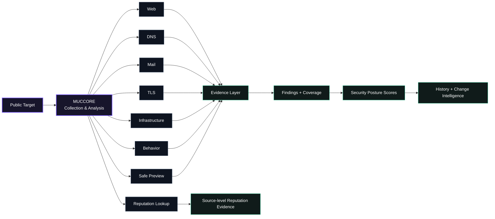
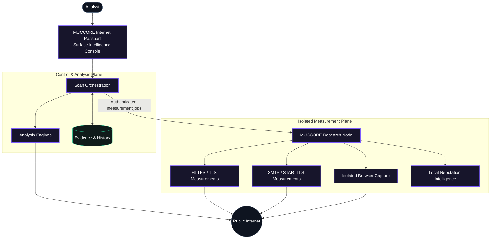
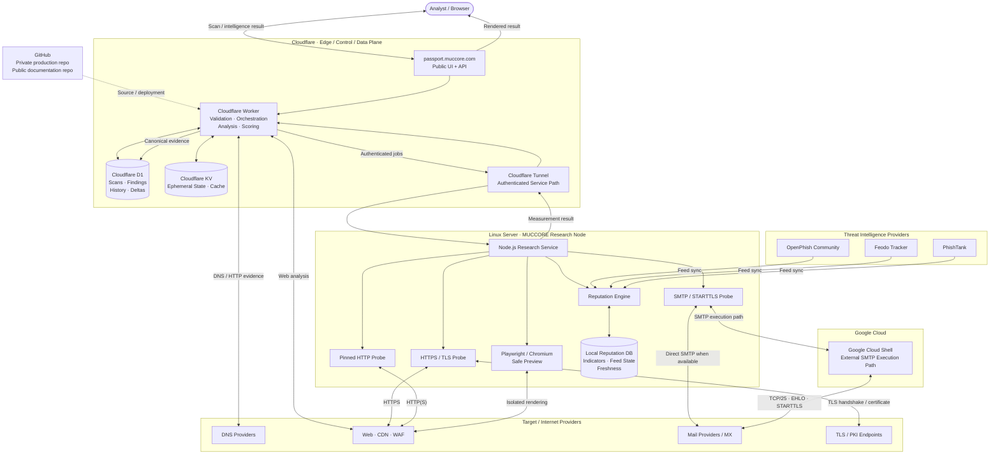

# MUCCORE Internet Passport

**Public Surface Intelligence for domains, URLs, and Internet-facing infrastructure.**

**Live platform:** https://passport.muccore.com  
**Türkçe:** [README.tr.md](README.tr.md)

MUCCORE Internet Passport turns public Internet exposure into an evidence-backed security posture view. It correlates web, DNS, mail, TLS, infrastructure and passive behavior evidence, adds an isolated visual preview, preserves historical observations, and provides a separate reputation lookup surface.

> This repository contains **public product documentation only**. Production source code, deployment configuration, private infrastructure details and operational secrets are intentionally not published here.

## What MUCCORE analyzes

A normal surface assessment contains seven research modules:

| Surface | Current coverage |
|---|---|
| **Web Security** | HTTP/HTTPS behavior, redirects, security headers, HSTS, CSP, framing controls, cookies and browser-facing policies |
| **DNS Security** | Public DNS records, DNSSEC, CAA, authoritative nameserver posture and related evidence |
| **Mail Security** | MX inventory, recursive SPF analysis, DMARC, MTA-STS, TLS-RPT and SMTP/STARTTLS transport evidence |
| **TLS & Certificates** | Certificate trust/hostname/chain/expiry, TLS 1.0–1.3 capability, negotiated cipher, bounded weak/deprecated cipher checks and forward-secrecy evidence |
| **Infrastructure** | Public IPv4/IPv6 relationships, PTR/rDNS, edge/topology evidence and bounded IP/ASN/network/geolocation enrichment |
| **Behavior Signals** | Passive bounded observations such as redirects, forms/password fields, iframes, external scripts and meta refresh |
| **Safe Preview** | Isolated browser rendering, static screenshot evidence and observed challenge/protection classification |

MUCCORE also provides coverage-aware scoring, structured findings, raw technical evidence, JSON export, 30-day scan history and comparison with previous completed observations.

## Reputation Intelligence

Reputation is a **separate lookup surface**, not one of the seven persisted scan modules. Domains, public IPv4 addresses and HTTP(S) URLs can be checked against MUCCORE's synchronized local threat-intelligence feeds.

Current feed coverage includes:

- **OpenPhish Community** — phishing URLs and hosts
- **Feodo Tracker** — botnet C2 IPv4 indicators
- **PhishTank** — verified online phishing URLs and hosts

Results preserve source-level matches, classifications, timestamps and feed-health context. A target that is not present in the configured feeds is **not automatically considered safe**, and MUCCORE does not manufacture an aggregate threat score from absence of evidence.

## Product model

```mermaid
flowchart LR
    T["Public Target"] --> C["MUCCORE<br/>Collection & Analysis"]
    C --> W["Web"]
    C --> D["DNS"]
    C --> M["Mail"]
    C --> L["TLS"]
    C --> I["Infrastructure"]
    C --> B["Behavior"]
    C --> P["Safe Preview"]
    C --> R["Reputation Lookup"]

    W --> E["Evidence Layer"]
    D --> E
    M --> E
    L --> E
    I --> E
    B --> E
    P --> E

    E --> F["Findings + Coverage"]
    F --> S["Security Posture Scores"]
    S --> H["History + Change Intelligence"]
    R --> RI["Source-level Reputation Evidence"]

    classDef core fill:#17152b,stroke:#7c5cff,color:#fff,stroke-width:2px;
    classDef module fill:#0e1420,stroke:#53657d,color:#fff;
    classDef evidence fill:#101b1a,stroke:#29c995,color:#fff;
    class T,C core;
    class W,D,M,L,I,B,P,R module;
    class E,F,S,H,RI evidence;
```

## High-level architecture

The public architecture intentionally describes responsibilities rather than private deployment details.

```mermaid
flowchart TB
    U([Analyst]) --> UI["MUCCORE Internet Passport<br/>Surface Intelligence Console"]

    subgraph CP["Control & Analysis Plane"]
        O["Scan Orchestration"]
        A["Analysis Engines"]
        S[("Evidence & History")]
        O --> A
        O <--> S
    end

    subgraph MP["Isolated Measurement Plane"]
        N["MUCCORE Research Node"]
        TP["HTTPS / TLS Measurements"]
        SP["SMTP / STARTTLS Measurements"]
        BP["Isolated Browser Capture"]
        RP["Local Reputation Intelligence"]
        N --> TP
        N --> SP
        N --> BP
        N --> RP
    end

    UI --> O
    O -->|"Authenticated measurement jobs"| N
    A --> NET((Public Internet))
    TP --> NET
    SP --> NET
    BP --> NET

    classDef edge fill:#17152b,stroke:#7c5cff,color:#fff,stroke-width:2px;
    classDef plane fill:#0e1420,stroke:#53657d,color:#fff;
    classDef data fill:#101b1a,stroke:#29c995,color:#fff;
    class UI,O,A,N,TP,SP,BP,RP edge;
    class U,NET plane;
    class S data;
```

The control and analysis plane validates targets, coordinates modules, normalizes evidence, calculates coverage-aware results and maintains historical observations. The isolated measurement plane performs measurements that require dedicated network sockets, browser execution or local reputation data.

## Deployment & provider topology

This view describes the real service/provider topology around MUCCORE, including components that are operational infrastructure rather than source-controlled application modules.

```mermaid
flowchart TB
    USER(["Analyst / Browser"])
    GH["GitHub<br/>Private production repo<br/>Public documentation repo"]

    subgraph CF["Cloudflare · Edge / Control / Data Plane"]
        EDGE["passport.muccore.com<br/>Public UI + API"]
        WORKER["Cloudflare Worker<br/>Validation · Orchestration<br/>Analysis · Scoring"]
        D1[("Cloudflare D1<br/>Scans · Findings<br/>History · Deltas")]
        KV[("Cloudflare KV<br/>Ephemeral State · Cache")]
        TUNNEL["Cloudflare Tunnel<br/>Authenticated Service Path"]
    end

    subgraph LINUX["Linux Server · MUCCORE Research Node"]
        RN["Node.js Research Service"]
        TLS["HTTPS / TLS Probe"]
        HTTP["Pinned HTTP Probe"]
        SMTP["SMTP / STARTTLS Probe"]
        PREVIEW["Playwright / Chromium<br/>Safe Preview"]
        REP["Reputation Engine"]
        RDB[("Local Reputation DB<br/>Indicators · Feed State<br/>Freshness")]
        RN --> TLS
        RN --> HTTP
        RN --> SMTP
        RN --> PREVIEW
        RN --> REP
        REP <--> RDB
    end

    subgraph GOOGLE["Google Cloud"]
        GCS["Google Cloud Shell<br/>External SMTP Execution Path"]
    end

    subgraph FEEDS["Threat Intelligence Providers"]
        OP["OpenPhish Community"]
        FEODO["Feodo Tracker"]
        PT["PhishTank"]
    end

    subgraph TARGET["Target / Internet Providers"]
        DNS["DNS Providers"]
        WEB["Web · CDN · WAF"]
        MX["Mail Providers / MX"]
        PKI["TLS / PKI Endpoints"]
    end

    USER <-->|"Scan / intelligence result"| EDGE
    GH -.->|"Source / deployment"| WORKER
    EDGE --> WORKER
    WORKER <--> D1
    WORKER <--> KV
    WORKER -->|"Authenticated jobs"| TUNNEL
    TUNNEL --> RN

    WORKER <-->|"DNS / HTTP evidence"| DNS
    WORKER <-->|"Web analysis"| WEB

    TLS <-->|"TLS handshake / certificate"| PKI
    TLS <-->|"HTTPS"| WEB
    HTTP <-->|"HTTP(S)"| WEB
    PREVIEW <-->|"Isolated rendering"| WEB

    SMTP <-->|"Direct SMTP when available"| MX
    SMTP <-->|"SMTP execution path"| GCS
    GCS <-->|"TCP/25 · EHLO · STARTTLS"| MX

    OP -->|"Feed sync"| REP
    FEODO -->|"Feed sync"| REP
    PT -->|"Feed sync"| REP

    RN -->|"Measurement result"| TUNNEL
    TUNNEL --> WORKER
    WORKER -->|"Canonical evidence"| D1
    EDGE -->|"Rendered result"| USER
```

The topology separates three kinds of state and execution: Cloudflare D1 stores persisted scan evidence/history, Cloudflare KV handles ephemeral state/cache, and the Linux Research Node keeps its own local reputation dataset. Google Cloud Shell is shown as a specialized external SMTP execution path rather than the primary application backend or database.

## Evidence-aware scoring

MUCCORE does not turn missing telemetry into an automatic security failure.

- `UNKNOWN` means evidence was unavailable or insufficient; it is not automatically a failure.
- `NOT_APPLICABLE` does not create a penalty.
- Informational observations are separated from score-impacting findings.
- Numeric conclusions can be withheld when required measurement coverage is missing.
- Overall scoring summarizes measured posture rather than pretending unavailable telemetry was observed.

A `PARTIAL` result therefore describes incomplete measurement, not automatically an insecure target.

## Safe Preview

Safe Preview provides visual context without embedding the live target in the analyst's browser. Modern pages can execute JavaScript inside the isolated capture environment, while browser traffic is constrained by validated, bounded egress controls.

The analyst receives a static screenshot and capture evidence rather than an interactive target session. Observed CAPTCHA, bot-protection, rate-limit or access-denied states can be classified as evidence; MUCCORE does not solve CAPTCHAs or perform site-specific anti-bot bypass.

## History & change intelligence

A single scan is a snapshot. Repeated observations turn it into a timeline. MUCCORE compares completed assessments to surface meaningful changes in security controls, mail posture, TLS capability, infrastructure evidence, certificate lifecycle, module coverage and scores.

Current product policy retains scan evidence for **30 days**. Safe Preview screenshots use a shorter **24-hour** retention window.

## Security philosophy

MUCCORE treats every target as untrusted input and is designed for public-surface, low-impact observation. Private/reserved network destinations are outside the intended target space.

The platform is **not** intended for exploit delivery, brute force, credential testing, destructive/state-changing requests, broad directory fuzzing or general-purpose port scanning.

## Current scope

Current production scope covers public Web, DNS, Mail, TLS, Infrastructure, passive Behavior Signals, isolated Preview, IP/network enrichment, evidence-aware scoring, historical comparison and source-level Reputation Intelligence.

DKIM analysis, general-purpose port scanning and offensive exploitation are outside the current V1 scope.

---

**MUCCORE Internet Passport** — evidence first, surface aware, built for understanding what the Internet can see.
