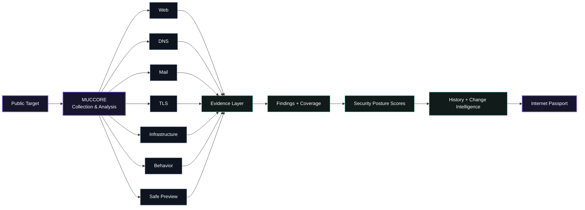
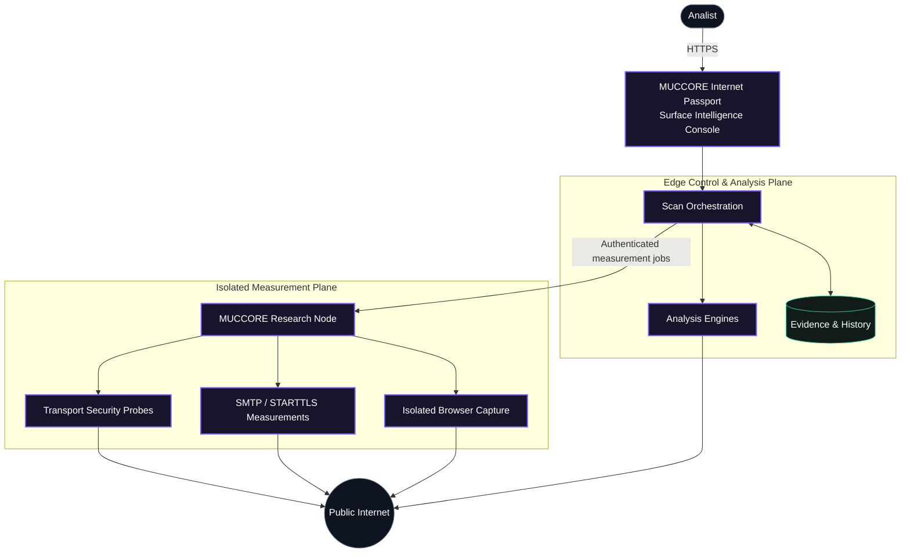
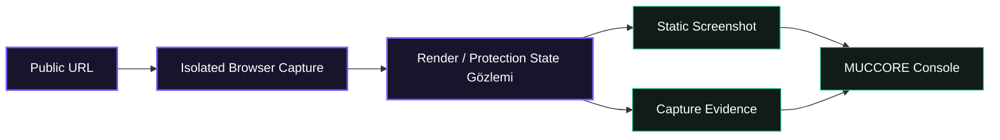

# MUCCORE Internet Passport

**Domain ve internete açık servisler için Public Surface Intelligence platformu.**

**Canlı platform:** https://passport.muccore.com  
**English:** [README.md](README.md)

MUCCORE Internet Passport, public bir domaini internete açık güvenlik duruşunun evidence-backed bir görünümüne dönüştürür. Tek değerlendirmede Web, DNS, Mail, TLS, Infrastructure ve Behavior evidence bir araya getirilir; izole Safe Preview ile görsel bağlam eklenir ve sonuç tek bir surface-intelligence konsolunda sunulur.

> Bu repository yalnızca **public ürün dokümantasyonu** içerir. Production source code, deployment configuration, internal endpoint'ler ve operasyonel secret'lar burada yayınlanmaz.

## MUCCORE neleri analiz ediyor?

| Yüzey | Kapsam |
|---|---|
| **Web Security** | HTTPS davranışı, redirect'ler, security header'lar, HSTS, CSP, framing korumaları, cookie attribute'ları ve browser-facing policy kontrolleri |
| **DNS Security** | Temel DNS kayıtları, DNSSEC, CAA, authoritative nameserver duruşu ve DNS evidence |
| **Mail Security** | MX topolojisi, SPF, DMARC, MTA-STS, TLS-RPT ve SMTP/STARTTLS transport evidence |
| **TLS & Certificates** | Protocol capability, certificate trust/hostname kontrolleri, chain/expiry evidence, cipher gözlemleri, legacy TLS ve forward secrecy |
| **Infrastructure** | Public IPv4/IPv6 ilişkileri, MX infrastructure, PTR/rDNS ve internete açık topology evidence |
| **Behavior Signals** | Redirect, form, password field, iframe, external script ve benzeri gözlemlenebilir davranış sinyalleri |
| **Safe Preview** | İzole browser rendering, statik screenshot evidence ve erişim challenge/protection sayfalarının tespit/sınıflandırılması |

Bunlara ek olarak MUCCORE coverage-aware scoring, structured findings, technical evidence, JSON export, scan history ve önceki gözlemlerle değişim karşılaştırması sunar.

## Ürün nasıl çalışıyor?

## Üst seviye mimari

Public dokümantasyondaki mimari bilinçli olarak **sorumlulukları** gösterir; private implementation ayrıntılarını yayınlamaz.

**Control & Analysis Plane** hedef doğrulama, modül koordinasyonu, evidence normalization, coverage-aware sonuç üretimi ve historical observation yönetimini üstlenir. **Isolated Measurement Plane** ise gerçek network veya browser runtime gerektiren ölçümleri gerçekleştirir. Böylece public application katmanı ile aktif measurement execution birbirinden ayrılır.

## Evidence-aware scoring

MUCCORE ölçülemeyen telemetry'yi otomatik güvenlik hatasına dönüştürmez.

- Her modül gerçekten ölçülmüş evidence üzerinden değerlendirilir.
- `UNKNOWN`, evidence'ın yetersiz veya ulaşılamaz olduğunu belirtir; otomatik failure değildir.
- `NOT_APPLICABLE` score cezası oluşturmaz.
- Informational observation'lar score-impacting finding'lerden ayrılır.
- Gerekli coverage eksikse MUCCORE yapay bir kesinlik üretmek yerine numeric sonucu withheld edebilir.

Böylece score, gözlemlenen security posture'un özeti olur; alttaki finding ve evidence yorumlanabilir biçimde korunur.

## Safe Preview

Safe Preview, canlı target sayfasını analistin browser'ına embed etmeden görsel bağlam üretmek için tasarlanmıştır.

Modern sayfaların doğru render edilebilmesi için izole capture ortamında JavaScript çalışabilir. Analiste target'ın canlı interaktif sayfası yerine statik visual/evidence çıktısı verilir. Gözlemlenen CAPTCHA, challenge, access-denied veya bot-protection durumları evidence olarak sınıflandırılabilir; MUCCORE CAPTCHA çözmeye veya siteye özel korumaları bypass etmeye çalışmaz.

## History & Change Intelligence

Tek scan bir snapshot'tır. Tekrarlanan gözlemler bu snapshot'ı timeline'a dönüştürür. MUCCORE yeni assessment'ı önceki stored evidence ile karşılaştırarak security policy, mail routing, TLS capability, certificate lifecycle ve module coverage/score gibi anlamlı posture değişikliklerini gösterebilir.

Mevcut ürün politikasında scan evidence **30 gün**, Safe Preview screenshot'ları ise **24 saat** tutulur.

## Güvenlik yaklaşımı

MUCCORE her target'ı untrusted input olarak kabul eder ve public-surface, low-impact observation yaklaşımıyla tasarlanmıştır. Private/reserved network destination'lar hedef kapsamının dışındadır ve measurement öncesinde outbound-target kontrolleri uygulanır.

Platform exploit delivery, brute force, credential testing, destructive request, broad directory fuzzing veya genel amaçlı port scanning için tasarlanmamıştır.

## Mevcut kapsam

MUCCORE aktif olarak geliştirilmektedir. Production kapsamı şu anda public Web, DNS, Mail, TLS, Infrastructure, passive Behavior Signals, isolated Preview, evidence-aware scoring ve historical comparison üzerine odaklanır. Daha zengin registration/provider intelligence ve ek enrichment özellikleri ürün geliştikçe eklenebilir.

---

**MUCCORE Internet Passport** — evidence first, surface aware, Internet'in ne gördüğünü anlamak için tasarlandı.
