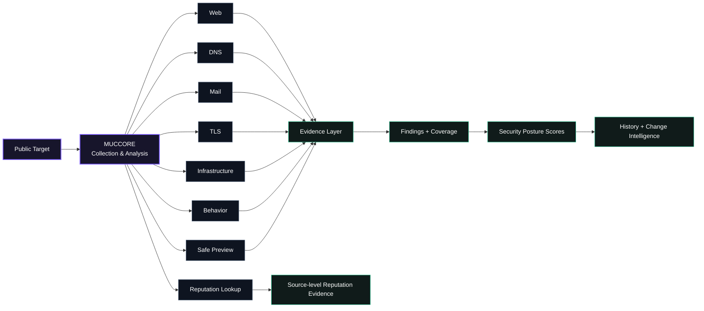
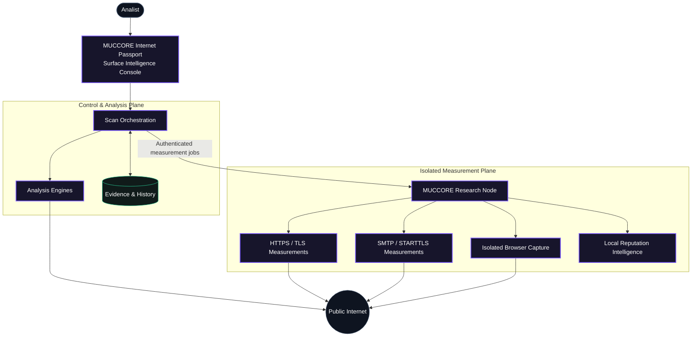
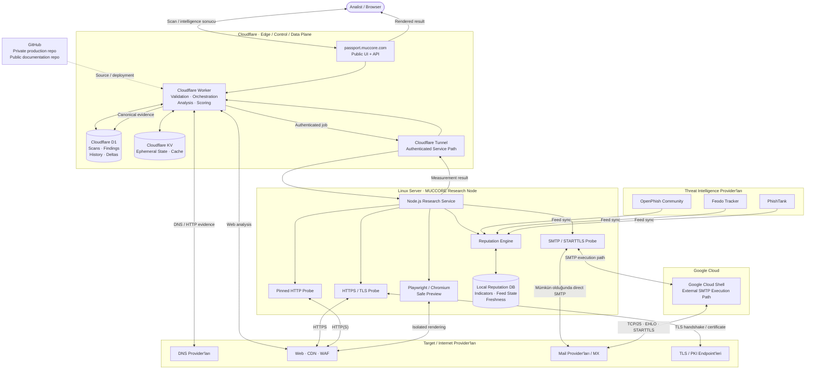

# MUCCORE Internet Passport

**Domain, URL ve internete açık altyapılar için Public Surface Intelligence platformu.**

**Canlı platform:** https://passport.muccore.com  
**English:** [README.md](README.md)

MUCCORE Internet Passport, internete açık yüzeyleri evidence-backed bir security posture görünümüne dönüştürür. Web, DNS, Mail, TLS, Infrastructure ve pasif Behavior evidence'ını bir araya getirir; izole Safe Preview ile görsel bağlam ekler, geçmiş gözlemleri saklar ve ayrı bir Reputation lookup yüzeyi sunar.

> Bu repository yalnızca **public ürün dokümantasyonu** içerir. Production source code, deployment configuration, private infrastructure ayrıntıları ve operasyonel secret'lar burada yayınlanmaz.

Reputation yüzeyi ayrıca canlı DNSBL/RHSBL kontrollerini kullanır: Spamhaus ZEN/DBL, SpamCop SCBL, DroneBL, SPFBL, UCEPROTECT Level 1–3, Backscatterer, PSBL, blocklist.de, Scientific Spam IP/RHSBL, Anonmails DNSBL ve Spam Eating Monkey URI. Domain/URL hedeflerinde en fazla iki çözümlenmiş public IPv4 adresi de uygun IP listelerinde kontrol edilir. Sağlayıcı timeout/erişim hataları temiz sonuç olarak değil, unavailable olarak raporlanır.

## MUCCORE neleri analiz ediyor?

Normal bir surface assessment yedi research modülünden oluşur:

| Yüzey | Güncel kapsam |
|---|---|
| **Web Security** | HTTP/HTTPS davranışı, redirect'ler, security header'lar, HSTS, CSP, framing kontrolleri, cookie'ler ve browser-facing policy'ler |
| **DNS Security** | Public DNS kayıtları, DNSSEC, CAA, authoritative nameserver posture ve ilgili evidence |
| **Mail Security** | MX envanteri, recursive SPF analizi, DMARC, MTA-STS, TLS-RPT ve SMTP/STARTTLS transport evidence |
| **TLS & Certificates** | Certificate trust/hostname/chain/expiry, TLS 1.0–1.3 capability, negotiated cipher, sınırlı weak/deprecated cipher kontrolleri ve forward-secrecy evidence |
| **Infrastructure** | Public IPv4/IPv6 ilişkileri, PTR/rDNS, edge/topology evidence ve sınırlı IP/ASN/network/geolocation enrichment |
| **Behavior Signals** | Redirect, form/password field, iframe, external script ve meta refresh gibi pasif/sınırlı gözlemler |
| **Safe Preview** | İzole browser rendering, statik screenshot evidence ve gözlemlenen challenge/protection sınıflandırması |

MUCCORE ayrıca coverage-aware scoring, structured findings, raw technical evidence, JSON export, **30 günlük scan history** ve önceki tamamlanmış gözlemlerle değişim karşılaştırması sunar.

## Reputation Intelligence

Reputation, yedi persisted scan modülünden biri değil; **ayrı bir lookup surface'idir**. Domain, public IPv4 ve HTTP(S) URL'ler MUCCORE'un senkronize lokal threat-intelligence feed'lerinde kontrol edilebilir.

Güncel feed kapsamı:

- **OpenPhish Community** — phishing URL ve host'ları
- **Feodo Tracker** — botnet C2 IPv4 indicator'ları
- **PhishTank** — verified/online phishing URL ve host'ları

Sonuçlar source-level match, classification, timestamp ve feed-health bağlamını korur. Configured feed'lerde bulunmayan bir target **otomatik olarak güvenli kabul edilmez** ve evidence yokluğundan yapay bir aggregate threat score üretilmez.

## Ürün modeli

```mermaid
flowchart LR
    T["Public Target"] --> C["MUCCORE<br/>Collection & Analysis"]
    C --> W["Web"]
    C --> D["DNS"]
    C --> M["Mail"]
    C --> L["TLS"]
    C --> I["Infrastructure"]
    C --> B["Behavior"]
    C --> P["Safe Preview"]
    C --> R["Reputation Lookup"]

    W --> E["Evidence Layer"]
    D --> E
    M --> E
    L --> E
    I --> E
    B --> E
    P --> E

    E --> F["Findings + Coverage"]
    F --> S["Security Posture Scores"]
    S --> H["History + Change Intelligence"]
    R --> RI["Source-level Reputation Evidence"]

    classDef core fill:#17152b,stroke:#7c5cff,color:#fff,stroke-width:2px;
    classDef module fill:#0e1420,stroke:#53657d,color:#fff;
    classDef evidence fill:#101b1a,stroke:#29c995,color:#fff;
    class T,C core;
    class W,D,M,L,I,B,P,R module;
    class E,F,S,H,RI evidence;
```

## Üst seviye mimari

Public dokümantasyon bilinçli olarak sorumlulukları gösterir; private deployment ayrıntılarını yayınlamaz.

```mermaid
flowchart TB
    U([Analist]) --> UI["MUCCORE Internet Passport<br/>Surface Intelligence Console"]

    subgraph CP["Control & Analysis Plane"]
        O["Scan Orchestration"]
        A["Analysis Engines"]
        S[("Evidence & History")]
        O --> A
        O <--> S
    end

    subgraph MP["Isolated Measurement Plane"]
        N["MUCCORE Research Node"]
        TP["HTTPS / TLS Measurements"]
        SP["SMTP / STARTTLS Measurements"]
        BP["Isolated Browser Capture"]
        RP["Local Reputation Intelligence"]
        N --> TP
        N --> SP
        N --> BP
        N --> RP
    end

    UI --> O
    O -->|"Authenticated measurement jobs"| N
    A --> NET((Public Internet))
    TP --> NET
    SP --> NET
    BP --> NET

    classDef edge fill:#17152b,stroke:#7c5cff,color:#fff,stroke-width:2px;
    classDef plane fill:#0e1420,stroke:#53657d,color:#fff;
    classDef data fill:#101b1a,stroke:#29c995,color:#fff;
    class UI,O,A,N,TP,SP,BP,RP edge;
    class U,NET plane;
    class S data;
```

Control & Analysis Plane target validation, modül koordinasyonu, evidence normalization, coverage-aware sonuç üretimi ve historical observation yönetimini üstlenir. Isolated Measurement Plane ise dedicated network socket'i, browser execution veya lokal reputation data gerektiren ölçümleri gerçekleştirir.

## Deployment ve provider topolojisi

Bu görünüm yalnızca source code mimarisini değil, MUCCORE etrafındaki gerçek servis/provider topolojisini gösterir. Bu nedenle repository içinde application module olarak bulunmayan operasyonel bileşenler de diyagramda yer alır.

```mermaid
flowchart TB
    USER(["Analist / Browser"])
    GH["GitHub<br/>Private production repo<br/>Public documentation repo"]

    subgraph CF["Cloudflare · Edge / Control / Data Plane"]
        EDGE["passport.muccore.com<br/>Public UI + API"]
        WORKER["Cloudflare Worker<br/>Validation · Orchestration<br/>Analysis · Scoring"]
        D1[("Cloudflare D1<br/>Scans · Findings<br/>History · Deltas")]
        KV[("Cloudflare KV<br/>Ephemeral State · Cache")]
        TUNNEL["Cloudflare Tunnel<br/>Authenticated Service Path"]
    end

    subgraph LINUX["Linux Server · MUCCORE Research Node"]
        RN["Node.js Research Service"]
        TLS["HTTPS / TLS Probe"]
        HTTP["Pinned HTTP Probe"]
        SMTP["SMTP / STARTTLS Probe"]
        PREVIEW["Playwright / Chromium<br/>Safe Preview"]
        REP["Reputation Engine"]
        RDB[("Local Reputation DB<br/>Indicators · Feed State<br/>Freshness")]
        RN --> TLS
        RN --> HTTP
        RN --> SMTP
        RN --> PREVIEW
        RN --> REP
        REP <--> RDB
    end

    subgraph GOOGLE["Google Cloud"]
        GCS["Google Cloud Shell<br/>External SMTP Execution Path"]
    end

    subgraph FEEDS["Threat Intelligence Provider'ları"]
        OP["OpenPhish Community"]
        FEODO["Feodo Tracker"]
        PT["PhishTank"]
    end

    subgraph TARGET["Target / Internet Provider'ları"]
        DNS["DNS Provider'ları"]
        WEB["Web · CDN · WAF"]
        MX["Mail Provider'ları / MX"]
        PKI["TLS / PKI Endpoint'leri"]
    end

    USER <-->|"Scan / intelligence sonucu"| EDGE
    GH -.->|"Source / deployment"| WORKER
    EDGE --> WORKER
    WORKER <--> D1
    WORKER <--> KV
    WORKER -->|"Authenticated job"| TUNNEL
    TUNNEL --> RN

    WORKER <-->|"DNS / HTTP evidence"| DNS
    WORKER <-->|"Web analysis"| WEB

    TLS <-->|"TLS handshake / certificate"| PKI
    TLS <-->|"HTTPS"| WEB
    HTTP <-->|"HTTP(S)"| WEB
    PREVIEW <-->|"Isolated rendering"| WEB

    SMTP <-->|"Mümkün olduğunda direct SMTP"| MX
    SMTP <-->|"SMTP execution path"| GCS
    GCS <-->|"TCP/25 · EHLO · STARTTLS"| MX

    OP -->|"Feed sync"| REP
    FEODO -->|"Feed sync"| REP
    PT -->|"Feed sync"| REP

    RN -->|"Measurement result"| TUNNEL
    TUNNEL --> WORKER
    WORKER -->|"Canonical evidence"| D1
    EDGE -->|"Rendered result"| USER
```

Topoloji üç farklı state/execution alanını ayırır: persisted scan evidence/history Cloudflare D1'da, ephemeral state/cache Cloudflare KV'de, reputation indicator ve feed state ise Linux Research Node üzerindeki lokal reputation database'de tutulur. Google Cloud Shell ana backend veya database değil; SMTP ölçümleri için kullanılan özel external execution path olarak gösterilir.

## Evidence-aware scoring

MUCCORE ölçülemeyen telemetry'yi otomatik güvenlik hatasına dönüştürmez.

- `UNKNOWN`, evidence'ın yetersiz veya ulaşılamaz olduğunu belirtir; otomatik failure değildir.
- `NOT_APPLICABLE` score cezası oluşturmaz.
- Informational observation'lar score-impacting finding'lerden ayrılır.
- Gerekli measurement coverage eksikse numeric sonuç verilmeyebilir.
- Overall scoring, unavailable telemetry'yi ölçülmüş gibi kabul etmek yerine gerçekten ölçülen posture'u özetler.

Bu yüzden `PARTIAL`, target'ın otomatik olarak güvensiz olduğu anlamına değil, ölçümün eksik kaldığı anlamına gelir.

## Safe Preview

Safe Preview, canlı target sayfasını analistin browser'ına embed etmeden görsel bağlam üretir. Modern sayfalar izole capture ortamında JavaScript çalıştırabilir; browser trafiği validated ve bounded egress kontrolleriyle sınırlandırılır.

Analiste interaktif target session yerine statik screenshot ve capture evidence verilir. Gözlemlenen CAPTCHA, bot-protection, rate-limit veya access-denied durumları evidence olarak sınıflandırılabilir; MUCCORE CAPTCHA çözmez veya siteye özel anti-bot bypass yapmaz.

## History & Change Intelligence

Tek scan bir snapshot'tır; tekrarlanan gözlemler bunu timeline'a dönüştürür. MUCCORE tamamlanmış assessment'ları karşılaştırarak security control, mail posture, TLS capability, infrastructure evidence, certificate lifecycle, module coverage ve score değişikliklerini gösterebilir.

Mevcut ürün politikasında scan evidence **30 gün**, Safe Preview screenshot'ları ise **24 saat** tutulur.

## Güvenlik yaklaşımı

MUCCORE her target'ı untrusted input olarak kabul eder ve public-surface, low-impact observation yaklaşımıyla tasarlanmıştır. Private/reserved network destination'lar hedef kapsamının dışındadır.

Platform exploit delivery, brute force, credential testing, destructive/state-changing request, broad directory fuzzing veya genel amaçlı port scanning için tasarlanmamıştır.

## Mevcut kapsam

Production kapsamı şu anda public Web, DNS, Mail, TLS, Infrastructure, passive Behavior Signals, isolated Preview, IP/network enrichment, evidence-aware scoring, historical comparison ve source-level Reputation Intelligence içerir.

DKIM analizi, genel amaçlı port scanning ve offensive exploitation mevcut V1 scope dışındadır.

---

**MUCCORE Internet Passport** — evidence first, surface aware, Internet'in ne gördüğünü anlamak için tasarlandı.
