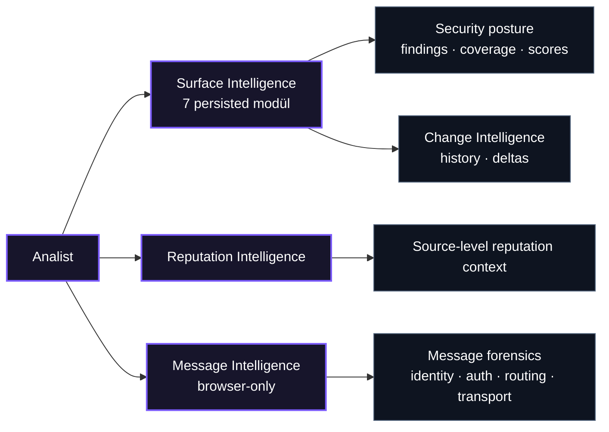
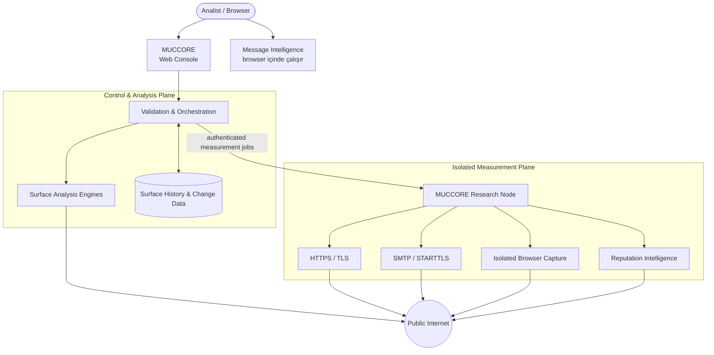
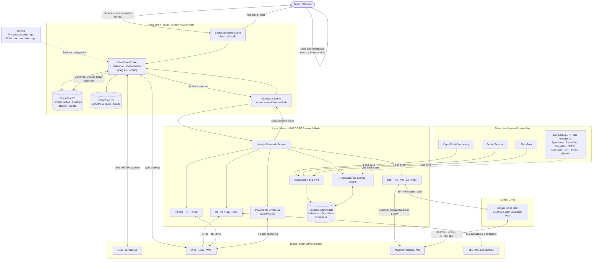

# MUCCORE Internet Passport

**Dijital varlığınızı dışarıdan görün.**

[](https://passport.muccore.com)
[](https://passport.muccore.com)

**Canlı platform:** https://passport.muccore.com  
**English:** [README.md](README.md)

MUCCORE Internet Passport, dijital varlığın dışarıdan nasıl göründüğünü anlamaya yönelik bir security research platformudur. Persisted **Surface Intelligence**, ayrı **Reputation Intelligence**, tamamen browser-side **Message Intelligence** ve **Change Intelligence** yeteneklerini tek üründe birleştirir.

> Bu repository yalnızca **public ürün dokümantasyonu** içerir. Production source code, secret'lar ve private operasyonel configuration burada yayınlanmaz.

## Ürüne genel bakış

### Surface Intelligence — 7 persisted scan modülü

| Modül | Neyi gözlemler? |
|---|---|
| **Web Security** | HTTP/HTTPS davranışı, redirect'ler, security header'lar, HSTS, CSP, framing kontrolleri, cookie'ler ve browser-facing policy'ler |
| **DNS Security** | Public DNS kayıtları, DNSSEC, CAA ve authoritative nameserver posture |
| **Mail Security** | MX envanteri, SPF, DMARC, MTA-STS, TLS-RPT ve SMTP/STARTTLS transport gözlemleri |
| **TLS & Certificates** | Certificate trust/hostname/chain/expiry, TLS capability, negotiated cipher ve sınırlı protocol/cipher gözlemleri |
| **Infrastructure** | Public IPv4/IPv6 ilişkileri, PTR/rDNS, edge/topology ve sınırlı network/ASN enrichment |
| **Behavior Signals** | Redirect, form/password field, iframe, external script ve meta refresh'in pasif/sınırlı gözlemleri |
| **Safe Preview** | İzole browser rendering, statik screenshot ve gözlemlenen challenge/protection durumları |

Surface sonuçlarında coverage-aware scoring, structured findings, raw teknik gözlemler, JSON export, history ve change comparison bulunur.

### Reputation Intelligence

Reputation, **yedi persisted Surface Scan modülünden ayrıdır**. Domain, public IPv4 ve HTTP(S) URL; senkronize lokal threat feed'leri ve canlı DNS reputation kaynaklarıyla araştırılabilir.

Güncel source family'leri OpenPhish, Feodo Tracker, PhishTank ve Spamhaus ZEN/DBL, SpamCop, DroneBL, SPFBL, UCEPROTECT, Backscatterer, PSBL, blocklist.de, Scientific Spam, Anonmails ve Spam Eating Monkey gibi DNSBL/RHSBL kaynaklarını içerir.

MUCCORE source semantiğini korur:

- provider failure/timeout **unavailable**'dır, clean değildir;
- “listede yok” **güvenli** anlamına gelmez;
- listing, source evidence'dır; tek başına malicious olduğunun kanıtı değildir;
- eksik gözlemden generic threat score üretilmez.

### Message Intelligence — browser-only header forensics

Message Intelligence, kullanıcının sağladığı raw e-mail header'ı analiz eder ve mevcut evidence ölçüsünde şunları yeniden oluşturur:

- visible ve envelope identity;
- raporlanan SPF, DKIM, DMARC ve ARC sonuçları;
- mevcutsa DKIM signing metadata;
- Received-hop journey ve timing;
- header'da bulunan transport/TLS ipuçları;
- MIME/content structure;
- mail-client/origin sinyalleri;
- vendor/security telemetry;
- duplicate, malformed, chronology ve alignment ile ilgili review sinyalleri;
- kategorize header açıklamaları ve raw evidence.

Raporlanan authentication, bağımsız cryptographic verification gibi sunulmaz. Receiving system `dkim=pass` raporladıysa MUCCORE bunu reported result olarak gösterir; browser'ın imzayı bağımsız doğruladığını iddia etmez.

#### Privacy

**E-mail header'ınız browser'ınızdan dışarı çıkmaz.**

```text
Raw header → browser-side analyzer → forensic result
```

Message Header Analyzer supplied header'ı MUCCORE sunucularına göndermez ve persist etmez. Message Intelligence için **retention yoktur**.

### Change Intelligence

Change Intelligence sekizinci scanner modülü değil, cross-cutting product capability'sidir. Tekrarlanan Surface Scan'ler önceki tamamlanmış gözlemlerle karşılaştırılabilir.

Güncel retention politikası:

| Veri | Retention |
|---|---:|
| Surface Scan evidence/history | **30 gün** |
| Safe Preview screenshot | **24 saat** |
| Message Intelligence raw header/result | **Saklanmaz** |

## Ürün modeli


```mermaid
flowchart LR
    A["Analist"] --> S["Surface Intelligence<br/>7 persisted modül"]
    A --> R["Reputation Intelligence"]
    A --> M["Message Intelligence<br/>browser-only"]

    S --> P["Security posture<br/>findings · coverage · scores"]
    S --> C["Change Intelligence<br/>history · deltas"]
    R --> RI["Source-level reputation context"]
    M --> MF["Message forensics<br/>identity · auth · routing · transport"]

    classDef primary fill:#17152b,stroke:#7c5cff,color:#fff,stroke-width:2px;
    classDef secondary fill:#0e1420,stroke:#53657d,color:#fff;
    class A,S,R,M primary;
    class P,C,RI,MF secondary;
```

## Üst seviye mimari

Public dokümantasyon sorumlulukları gösterir; private deployment ayrıntılarını bilinçli olarak yayınlamaz.


```mermaid
flowchart TB
    U(["Analist / Browser"])
    UI["MUCCORE<br/>Web Console"]

    subgraph CP["Control & Analysis Plane"]
        O["Validation & Orchestration"]
        A["Surface Analysis Engines"]
        H[("Surface History & Change Data")]
    end

    subgraph MP["Isolated Measurement Plane"]
        N["MUCCORE Research Node"]
        T["HTTPS / TLS"]
        S["SMTP / STARTTLS"]
        B["Isolated Browser Capture"]
        R["Reputation Intelligence"]
    end

    M["Message Intelligence<br/>browser içinde çalışır"]

    U --> UI
    U --> M
    UI --> O
    O --> A
    O <--> H
    O -->|"authenticated measurement jobs"| N
    N --> T
    N --> S
    N --> B
    N --> R
    A --> NET(("Public Internet"))
    T --> NET
    S --> NET
    B --> NET
    R --> NET
```

Buradaki önemli sınır bilinçlidir: Surface Scan state/history server-side ürün datasıdır; Message Intelligence ise analistin browser'ında kalır.

## Deployment ve provider topolojisi

Bu map generic bir application diagramına indirgenmeden MUCCORE'un gerçek operasyonel topolojisini korur.


```mermaid
flowchart TB
    USER(["Analist / Browser"])
    GH["GitHub<br/>Private production repo<br/>Public documentation repo"]

    subgraph CF["Cloudflare · Edge / Control / Data Plane"]
        EDGE["passport.muccore.com<br/>Public UI + API"]
        WORKER["Cloudflare Worker<br/>Validation · Orchestration<br/>Analysis · Scoring"]
        D1[("Cloudflare D1<br/>Surface scans · Findings<br/>History · Deltas")]
        KV[("Cloudflare KV<br/>Ephemeral State · Cache")]
        TUNNEL["Cloudflare Tunnel<br/>Authenticated Service Path"]
    end

    subgraph LINUX["Linux Server · MUCCORE Research Node"]
        RN["Node.js Research Service"]
        TLS["HTTPS / TLS Probe"]
        HTTP["Pinned HTTP Probe"]
        SMTP["SMTP / STARTTLS Probe"]
        PREVIEW["Playwright / Chromium<br/>Safe Preview"]
        REP["Reputation Intelligence Engine"]
        RDB[("Local Reputation DB<br/>Indicators · Feed State<br/>Freshness")]
        SYNC["Reputation Feed Sync"]
        RN --> TLS
        RN --> HTTP
        RN --> SMTP
        RN --> PREVIEW
        RN --> REP
        SYNC --> RDB
        REP <--> RDB
    end

    subgraph GOOGLE["Google Cloud"]
        GCS["Google Cloud Shell<br/>External SMTP Execution Path"]
    end

    subgraph FEEDS["Threat Intelligence Provider'ları"]
        OP["OpenPhish Community"]
        FEODO["Feodo Tracker"]
        PT["PhishTank"]
        DNSBL["Live DNSBL / RHSBL Provider'ları<br/>Spamhaus · SpamCop · DroneBL · SPFBL<br/>UCEPROTECT · PSBL · diğerleri"]
    end

    subgraph TARGET["Target / Internet Provider'ları"]
        DNS["DNS Provider'ları"]
        WEB["Web · CDN · WAF"]
        MX["Mail Provider'ları / MX"]
        PKI["TLS / PKI Endpoint'leri"]
    end

    USER <-->|"Surface scan / reputation sonucu"| EDGE
    USER -->|"Message Intelligence<br/>yalnızca browser-side"| USER
    GH -.->|"Source / deployment"| WORKER
    EDGE --> WORKER
    WORKER <--> D1
    WORKER <--> KV
    WORKER -->|"Authenticated job"| TUNNEL
    TUNNEL --> RN

    WORKER <-->|"DNS / HTTP evidence"| DNS
    WORKER <-->|"Web analysis"| WEB
    TLS <-->|"TLS handshake / certificate"| PKI
    TLS <-->|"HTTPS"| WEB
    HTTP <-->|"HTTP(S)"| WEB
    PREVIEW <-->|"Isolated rendering"| WEB

    SMTP <-->|"Mümkün olduğunda direct SMTP"| MX
    SMTP <-->|"SMTP execution path"| GCS
    GCS <-->|"TCP/25 · EHLO · STARTTLS"| MX

    OP -->|"Feed sync"| SYNC
    FEODO -->|"Feed sync"| SYNC
    PT -->|"Feed sync"| SYNC
    DNSBL -.->|"Live DNS query"| REP

    RN -->|"Measurement result"| TUNNEL
    TUNNEL --> WORKER
    WORKER -->|"Canonical Surface Scan evidence"| D1
    EDGE -->|"Rendered result"| USER
```

Cloudflare D1 persisted Surface Scan lifecycle/evidence/history/delta için source of truth'tur; KV ephemeral state/cache'tir. Linux Research Node kendi lokal reputation dataset'ini ve feed freshness bilgisini tutar. Senkronize feed'ler lokal store'a akar; DNSBL/RHSBL provider'ları ise canlı sorgulanır. Google Cloud Shell primary backend/database değil, özel external SMTP execution path'tir. Message Intelligence bu persistence yollarının bilinçli olarak dışındadır ve browser'da kalır.

## Scoring semantiği

MUCCORE coverage-aware çalışır:

- `UNKNOWN` otomatik failure değildir.
- `NOT_APPLICABLE` ceza oluşturmaz.
- Informational observation'lar score-impacting finding'lerden ayrılır.
- Gerekli coverage yoksa numeric score verilmeyebilir.
- `PARTIAL`, otomatik insecure target değil eksik measurement anlamına gelir.
- Reputation source status bir safety score değildir.

## Safe Preview

Safe Preview canlı target sayfasını analistin browser'ına embed etmeden görsel bağlam üretir. Target izole browser ortamında bounded network kontrolleriyle render edilir ve ürün **statik screenshot** + capture context döndürür.

Gözlemlenen CAPTCHA, bot-protection, rate-limit veya access-denied durumları sınıflandırılabilir; MUCCORE CAPTCHA çözmez veya site-specific anti-bot bypass yapmaz.

## Güvenlik yaklaşımı

MUCCORE public Internet yüzeylerinde düşük etkili gözlem için tasarlanmıştır. Target'lar untrusted input kabul edilir; private/reserved destination'lar hedef kapsamı dışındadır.

Platform exploit delivery, brute force, credential testing, destructive/state-changing request, broad directory fuzzing veya genel amaçlı port scanning için tasarlanmamıştır.

## Product Roadmap

Aşağıdaki workflow'lar **planlanmaktadır ve henüz mevcut değildir**:

1. **Exposure Intelligence** — passive asset discovery ve gözlemlenebilir hostname/DNS/certificate/network ilişkileri.
2. **Brand & Impersonation Intelligence** — lookalike/typosquat araştırması; registration, DNS, certificate ve reputation context.
3. **Certificate Intelligence** — certificate/SAN/issuer/expiry timeline ve yeni gözlemlenen isimler.
4. **Domain Lifecycle Intelligence** — nameserver, MX, certificate, network ve posture değişimlerinin kronolojik görünümü.
5. **Email Infrastructure Intelligence** — beklenen sending infrastructure ile Message Intelligence gözlemlerinin korelasyonu.
6. **URL Intelligence** — redirect journey, hostname transition, reputation, behavior ve Safe Preview.
7. **Compare Targets** — ölçülen control, coverage ve finding'leri yapay competitive ranking üretmeden yan yana karşılaştırma.
8. **Continuous Intelligence** — watchlist, repeat observation, anlamlı change detection ve alert'ler.

## Güncel scope notları

- Surface Scan execution şu anda request-bound çalışır.
- Surface Mail full DKIM cryptographic verification'ı bağımsız olarak yapmaz; Message Intelligence supplied header içindeki authentication result'larını parse edip açıklar.
- Reputation coverage source freshness ve provider availability'ye bağlıdır.
- Network kısıtları bazı SMTP transport gözlemlerini unknown bırakabilir.

---

**MUCCORE Internet Passport** — dijital varlığınızın dışarıdan nasıl göründüğünü göstermek için tasarlandı.
